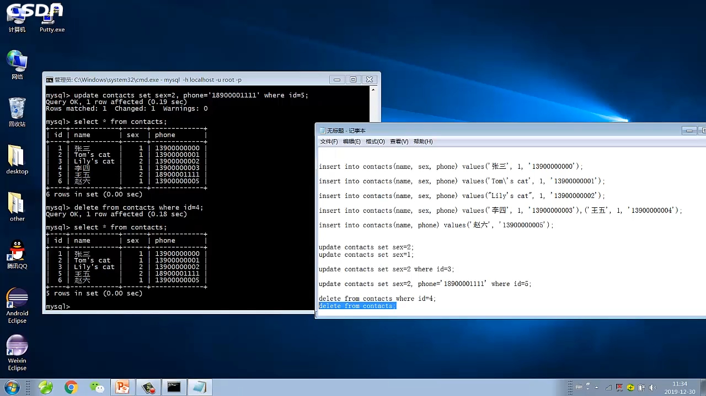

# Demo2

## 链接 Demo
### 内嵌式链接
- 外部链接:[百度](https://www.baidu.com)
- 内部链接1:链接仓库的其他文件[BasicLink类.md](BasicLink类.md)
- 内部链接2:链接本文档的其他部分[代码块](Demo2.md#代码块-Demo)
### 引用式链接
- 外部链接:[百度]
- 外部链接:[百度][baidu]
- 内部链接1:链接仓库的其他文件[BasicLink类.md]
- 内部链接2:链接本文档的其他部分[代码块]
## 图片 Demo
### 引用式链接


### 内嵌式链接
![百度][baidu_logo]
![][open_png]
## 引用 Demo
> 这是引文。  

——出自《哪里》
>>> 这是引文。
## 代码块 Demo
test `var a = 10` testtesttesttesttesttesttesttesttesttesttesttesttesttesttesttesttesttesttesttesttesttesttesttesttesttest
```javascript
var a = 10;
console.log(a);
```
    var a = 10;
    console.log(a);
<!--  -->
[百度]:https://www.baidu.com
[baidu]:https://www.baidu.com
[BasicLink类.md]:BasicLink类.md
[代码块]:Demo2.md#代码块-Demo
[baidu_logo]:https://www.baidu.com/img/PCtm_d9c8750bed0b3c7d089fa7d55720d6cf.png
[open_png]:insert_update_delete.png "insert_update_delete.png"